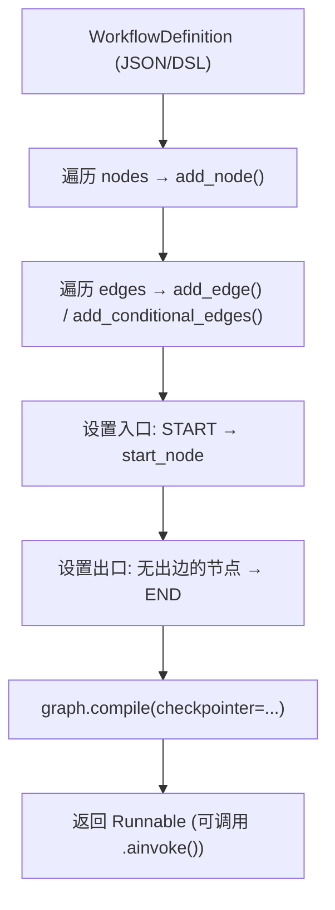
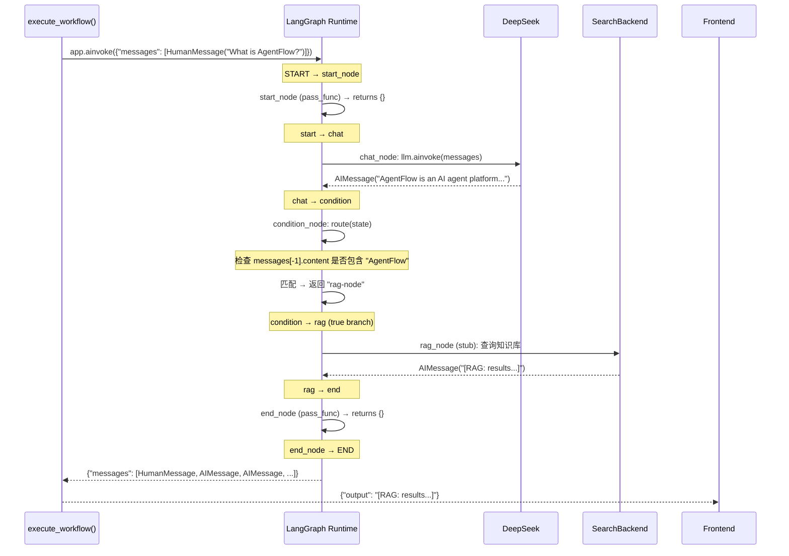

# Workflow Builder 深度解析

> 可视化 AI 工作流编排：从前端画布拖拽到后端 LangGraph 编译执行的完整链路

---

## 一、架构总览

```
┌─────────────────────────────────────────────────────────────────────┐
│                         Frontend (React)                             │
│  ┌───────────────────────────────────────────────────────────────┐  │
│  │  WorkflowEditor.tsx                                            │  │
│  │  ┌──────────┐   ┌──────────────────────────────────────────┐  │  │
│  │  │ Sidebar   │   │           ReactFlow Canvas                │  │  │
│  │  │ Palette   │   │  ┌──────┐    ┌──────┐    ┌──────┐       │  │  │
│  │  │ ────────  │   │  │ START│───▶│ Chat │───▶│ END  │       │  │  │
│  │  │ Chat      │   │  └──────┘    └──────┘    └──────┘       │  │  │
│  │  │ RAG       │   │                                          │  │  │
│  │  │ Search    │   │  Nodes: drag-from-palette / + button     │  │  │
│  │  │ Tool      │   │  Edges: drag handles to connect          │  │  │
│  │  │ Condition │   │                                          │  │  │
│  │  │ Loop      │   │  [Save] → POST /api/v1/workflows         │  │  │
│  │  │ HITL      │   │  [Execute] → POST /.../execute           │  │  │
│  │  └──────────┘   └──────────────────────────────────────────┘  │  │
│  └───────────────────────────────────────────────────────────────┘  │
└──────────────────────────────────┬──────────────────────────────────┘
                                   │  HTTP/JSON
                                   ▼
┌─────────────────────────────────────────────────────────────────────┐
│                         Backend (FastAPI)                             │
│  ┌───────────────────────────────────────────────────────────────┐  │
│  │  POST /api/v1/workflows         → save_workflow()              │  │
│  │  GET  /api/v1/workflows         → list_workflows()             │  │
│  │  GET  /api/v1/workflows/{id}    → get_workflow()               │  │
│  │  POST /api/v1/workflows/{id}/execute → execute_workflow()     │  │
│  └───────────────────────────────────────────────────────────────┘  │
│                                   │                                  │
│                    ┌──────────────┼──────────────┐                   │
│                    ▼              ▼              ▼                   │
│  ┌─────────────────────┐ ┌──────────────┐ ┌────────────────────┐    │
│  │ WorkflowDefinition  │ │ Compiler     │ │ LangGraph Runtime  │    │
│  │ (schema.py)         │ │ (compiler.py)│ │ (StateGraph)       │    │
│  │                     │ │              │ │                    │    │
│  │ Pydantic Models     │ │ DSL→Graph    │ │ .compile()         │    │
│  │ JSON validation     │ │ Node→Func    │ │ .ainvoke()         │    │
│  │ Node/Edge types     │ │ Edge→Route   │ │ Checkpointer       │    │
│  └─────────────────────┘ └──────────────┘ └────────────────────┘    │
└─────────────────────────────────────────────────────────────────────┘
```

**核心思想**：前端画布上每一个"节点"在视觉上是 ReactFlow 的一个 Node，在后端编译时变成一个 LangGraph StateGraph 的 node 函数。**连线（Edge）**则变成 StateGraph 的 edge 或 conditional_edge。前端产生的 JSON 就是 DSL（领域特定语言），Compiler 将其翻译为可执行的 LangGraph 图。

---

## 二、DSL Schema — 工作流的"语言"

DSL 定义在 `backend/app/core/workflow/schema.py`，用 Pydantic 模型严格定义工作流的 JSON 结构。它是前端和后端的**唯一通信契约**。

### 2.1 核心模型

```python
# ── 节点类型枚举 ──────────────────────────────────────────

class WorkflowNode(BaseModel):
    id: str          # UUID，画布上每个节点的唯一标识
    type: Literal[   # 9 种节点类型
        "start",      # 入口（每个工作流有且仅有一个）
        "chat",       # LLM 对话节点
        "rag",        # 知识库检索节点
        "search",     # Web 搜索节点
        "tool",       # 工具调用节点
        "condition",  # 条件分支节点（if/else 路由）
        "loop",       # 循环节点
        "hitl",       # Human-in-the-Loop 审批节点
        "end",        # 出口
    ]
    position: NodePosition   # 画布坐标 {x, y}
    data: dict               # 节点配置（不同类型的 data 不同）

# ── 边模型 ────────────────────────────────────────────────

class WorkflowEdge(BaseModel):
    id: str
    source: str          # 源节点 ID
    target: str          # 目标节点 ID
    source_handle: str | None  # 条件节点用：标识 true/false 分支
    label: str | None           # 显示标签

# ── 工作流定义（顶层 DSL） ─────────────────────────────────

class WorkflowDefinition(BaseModel):
    id: str
    name: str
    description: str
    nodes: list[WorkflowNode]
    edges: list[WorkflowEdge]

    def get_node(self, node_id: str) -> WorkflowNode | None: ...
    def get_outgoing(self, node_id: str) -> list[WorkflowEdge]: ...
    def get_start_node(self) -> WorkflowNode | None: ...
```

### 2.2 每种节点的配置数据

```python
# Chat 节点：自定义 system prompt
class ChatNodeData(BaseModel):
    system_prompt: str = ""

# RAG 节点：绑定知识库
class RAGNodeData(BaseModel):
    knowledge_base_id: str = ""

# Tool 节点：选择工具
class ToolNodeData(BaseModel):
    tool_name: str = ""

# Condition 节点：条件路由
class ConditionNodeData(BaseModel):
    field: str = ""                          # 判断的字段
    operator: Literal["equals","contains","gt","lt"] = "contains"
    value: str = ""                          # 比较值
    true_branch: str = ""                    # true 目标节点 ID
    false_branch: str = ""                   # false 目标节点 ID

# Loop 节点：循环控制
class LoopNodeData(BaseModel):
    input_field: str = ""                    # 要迭代的数组字段
    max_iterations: int = 5                  # 最大迭代次数

# HITL 节点：人工审批
class HITLNodeData(BaseModel):
    approval_message: str = "Approve this action?"
```

### 2.3 DSL JSON 实例

用户拖拽 "Chat → RAG → End" 后生成：

```json
{
  "id": "wf-abc123",
  "name": "Customer Support Bot",
  "description": "",
  "nodes": [
    {"id": "start",     "type": "start", "position": {"x": 50,  "y": 200}, "data": {}},
    {"id": "chat-1728", "type": "chat",  "position": {"x": 250, "y": 200}, "data": {"system_prompt": "You are a helpful support agent."}},
    {"id": "rag-3391",  "type": "rag",   "position": {"x": 450, "y": 200}, "data": {"knowledge_base_id": "kb-docs"}},
    {"id": "end",       "type": "end",   "position": {"x": 650, "y": 200}, "data": {}}
  ],
  "edges": [
    {"id": "e1", "source": "start",     "target": "chat-1728"},
    {"id": "e2", "source": "chat-1728", "target": "rag-3391"},
    {"id": "e3", "source": "rag-3391",  "target": "end"}
  ]
}
```

这个 JSON 完全由前端画布操作生成，后端原样存储。关键在于：**JSON 本身既是存储格式，也是可执行的 DSL**。

---

## 三、Compiler — 从 JSON 到可执行 Graph

Compiler 在 `backend/app/core/workflow/compiler.py`，是整个系统的**核心引擎**。它做一件事：将 `WorkflowDefinition` 翻译为 LangGraph 的 `StateGraph`。

### 3.1 编译流程



### 3.2 compile() 主方法

```python
class WorkflowCompiler:
    def compile(
        self,
        workflow: WorkflowDefinition,
        checkpointer: BaseCheckpointSaver | None = None,
    ):
        # Step 1: 创建空的 StateGraph，复用 ChatState 作为消息载体
        graph = StateGraph(ChatState)
        # ChatState = TypedDict { messages: Annotated[list, operator.add] }

        # Step 2: 注册节点 —— 每个 WorkflowNode → 一个 LangGraph node
        for node in workflow.nodes:
            graph.add_node(node.id, self._make_node_func(node))

        # Step 3: 注册边 —— 普通边 vs 条件边
        for edge in workflow.edges:
            source_node = workflow.get_node(edge.source)
            if source_node and source_node.type == "condition":
                # 条件节点：使用路由函数 + 分支映射
                graph.add_conditional_edges(
                    edge.source,
                    self._make_condition_func(source_node),
                    {
                        edge.source_handle or "true": edge.target,
                    }
                )
            else:
                # 普通节点：直接连线
                graph.add_edge(edge.source, edge.target)

        # Step 4: 设置入口 —— START → 第一个节点
        start_node = workflow.get_start_node()
        if start_node:
            graph.add_edge(START, start_node.id)

        # Step 5: 自动收尾 —— 无出边的节点 → END
        for node in workflow.nodes:
            if node.type == "end":
                graph.add_edge(node.id, END)
            elif not workflow.get_outgoing(node.id) and node.type != "end":
                graph.add_edge(node.id, END)

        # Step 6: 编译为可执行对象
        return graph.compile(checkpointer=checkpointer)
```

### 3.3 节点函数工厂 — `_make_node_func()`

这是编译器的核心：**将节点的 type + data 映射为一个异步函数**。每个函数签名统一为 `(state: ChatState) -> dict`，返回值被 LangGraph 的 reducer（`operator.add`）自动追加到 messages 列表。

```python
def _make_node_func(self, node: WorkflowNode):
    """根据节点类型返回对应的执行函数"""
    node_id = node.id
    node_type = node.type

    # ── Chat 节点：调用 LLM ────────────────────────────
    async def chat_func(state: ChatState) -> dict:
        llm = ChatOpenAI(
            base_url=settings.DEEPSEEK_BASE_URL,
            api_key=settings.DEEPSEEK_API_KEY,
            model="deepseek-chat", temperature=0.7,
        )
        prompt = node.data.get("system_prompt", "")
        msgs = list(state["messages"])
        if prompt:
            from langchain_core.messages import SystemMessage
            msgs.insert(0, SystemMessage(content=prompt))
        response = await llm.ainvoke(msgs)
        return {"messages": [response]}

    # ── Search 节点：调用 Web Search ────────────────────
    async def search_func(state: ChatState) -> dict:
        from app.core.tool.builtins.search_backends import get_search_backend
        last_msg = state["messages"][-1].content if state["messages"] else ""
        backend = get_search_backend()
        results = await backend.search(last_msg, max_results=5)
        if not results:
            return {"messages": [AIMessage(content=f"No results found.")]}
        lines = [f"Web search results (via {backend.name}):\n"]
        for i, r in enumerate(results):
            lines.append(f"{i + 1}. {r.to_llm_text()}")
        return {"messages": [AIMessage(content="\n\n".join(lines))]}

    # ── RAG 节点：知识库检索 ────────────────────────────
    async def rag_func(state: ChatState) -> dict:
        kb_id = node.data.get("knowledge_base_id", "")
        last_msg = state["messages"][-1].content if state["messages"] else ""
        result = f"[RAG search in KB {kb_id[:8]}...]: results for '{last_msg[:50]}...'"
        return {"messages": [AIMessage(content=result)]}

    # ── Condition / Loop / Start / End: 透传 ─────────────
    async def pass_func(state: ChatState) -> dict:
        return {}

    handlers = {
        "chat": chat_func, "search": search_func, "rag": rag_func,
        "tool": tool_func, "hitl": hitl_func,
        "start": pass_func, "end": pass_func,
        "condition": pass_func, "loop": pass_func,
    }
    return handlers.get(node_type, pass_func)
```

**关键设计点**：

1. **闭包捕获 node 配置**：每个节点函数通过闭包持有 `node.data`，所以运行时拿到的就是该节点在画布上配置的参数（system_prompt、kb_id 等）。

2. **统一返回格式**：所有函数返回 `{"messages": [...]}`，与 `ChatState` 的 `operator.add` reducer 配合 —— 新消息自动追加到历史。

3. **ChatState 复用**：Workflow 复用了对话引擎的 `ChatState`（`messages: Annotated[list, operator.add]`），这意味着所有节点通过 `messages` 这个共享状态自然传递数据，无需额外的数据流定义。

### 3.4 条件路由函数

```python
@staticmethod
def _make_condition_func(node: WorkflowNode):
    """创建条件分支的路由函数"""
    field = node.data.get("field", "")
    operator = node.data.get("operator", "contains")
    value = node.data.get("value", "")
    true_branch = node.data.get("true_branch", "")
    false_branch = node.data.get("false_branch", "")

    def route(state: ChatState) -> str:
        if not state["messages"]:
            return false_branch or "end"
        last = state["messages"][-1].content or ""

        if operator == "contains":
            match = value.lower() in last.lower()
        elif operator == "equals":
            match = last.strip().lower() == value.lower().strip()
        elif operator == "gt":
            try: match = float(last) > float(value)
            except ValueError: match = False
        elif operator == "lt":
            try: match = float(last) < float(value)
            except ValueError: match = False
        else:
            match = False

        return true_branch if match else (false_branch or "end")

    return route
```

LangGraph 的 `add_conditional_edges` 要求路由函数返回一个字符串，该字符串对应一个目标节点 ID。编译时的映射 `{edge.source_handle or "true": edge.target}` 决定了 true/false 分支的目标。

---

## 四、前端 — ReactFlow 画布

### 4.1 组件结构

```
WorkflowEditor (page)
├── ListView           ← 工作流列表（卡片网格）
│   └── 每个卡片: name, nodes/edges count, 点击进入 EditorView
│
└── EditorView         ← 画布编辑器
    ├── Sidebar (w-48)
    │   ├── Back 按钮
    │   ├── 标题输入
    │   ├── 节点 Palette（拖拽源）
    │   │   Chat | RAG | Web Search | Tool | Condition | Loop | HITL
    │   ├── [Save] 按钮
    │   └── [Execute] 按钮（含执行结果面板）
    │
    └── ReactFlow Canvas
        ├── Controls (缩放/居中/锁定)
        ├── Background (点阵)
        ├── MiniMap (缩略图)
        ├── StartNode / EndNode (固定位置)
        └── Custom Nodes (7 种类型，每种不同颜色和图标)
```

### 4.2 节点注册与类型映射

前端有**两层类型映射**：

```typescript
// 1. 前端显示类型 → 后端 DSL 类型（保存时）
function mapType(t: string | undefined) {
  if (t === "startNode") return "start";
  if (t === "endNode") return "end";
  return t || "chat";  // chat/rag/search/tool/condition/loop/hitl 保持不变
}

// 2. ReactFlow 自定义节点注册
const nodeTypes = {
  startNode: StartNode,    // 圆形 START 组件
  endNode: EndNode,        // 圆形 END 组件
  chat: (p) => <CustomNode {...p} type="chat" />,
  rag: (p) => <CustomNode {...p} type="rag" />,
  search: (p) => <CustomNode {...p} type="search" />,
  tool: (p) => <CustomNode {...p} type="tool" />,
  condition: (p) => <CustomNode {...p} type="condition" />,
  loop: (p) => <CustomNode {...p} type="loop" />,
  hitl: (p) => <CustomNode {...p} type="hitl" />,
};
```

**为什么前端的 type 和后端 DSL 的 type 不同？** START/END 在 ReactFlow 中有特殊的视觉样式（圆形），所以前端用 `startNode`/`endNode` 区分。保存时通过 `mapType()` 转回 `start`/`end`。加载时反向转换。

### 4.3 三种建节点方式

```typescript
// 方式 1: 从左侧 Palette 拖拽到画布（HTML5 drag & drop）
const onDrop = useCallback((e: DragEvent) => {
  e.preventDefault();
  const type = e.dataTransfer.getData("application/reactflow");
  if (!type || !rfInstance) return;
  const pos = rfInstance.screenToFlowPosition({
    x: e.clientX - bounds.left,
    y: e.clientY - bounds.top
  });
  const id = `${type}-${Date.now()}`;
  setNodes((nds) => [...nds, {
    id, type, position: pos,
    data: { label: type, onAddNode: addNodeAfter }
  }]);
}, [rfInstance, setNodes, addNodeAfter]);

// 方式 2: 点击节点右侧的 [+] 按钮，弹出下拉菜单选择类型
const addNodeAfter = useCallback((sourceId: string, nodeType: string) => {
  setNodes((nds) => {
    const src = nds.find(n => n.id === sourceId);
    if (!src) return nds;
    const newNode = {
      id: `${nodeType}-${Date.now()}`,
      type: nodeType,
      position: {
        x: src.position.x + 220,                    // 在源节点右侧 220px
        y: src.position.y + (Math.random() - 0.5) * 100  // 随机偏移
      },
      data: { label: nodeType, onAddNode: addNodeAfter },
    };
    // 自动创建连线
    setEdges((eds) => [...eds, {
      id: `e-${sourceId}-${newNode.id}`,
      source: sourceId, target: newNode.id,
      markerEnd: { type: MarkerType.ArrowClosed },
    }]);
    return [...nds, newNode];
  });
}, [setNodes, setEdges]);

// 方式 3: 从节点的 Handle 拖出连线到另一个节点的 Handle
const onConnect = useCallback(
  (params: Connection) => setEdges((eds) =>
    addEdge({ ...params, markerEnd: { type: MarkerType.ArrowClosed } }, eds)
  ),
  [setEdges]
);
```

### 4.4 CustomNode 组件 — 带 Handle 和 [+] 按钮

```tsx
function CustomNode({ id, data, type }) {
  const [menuOpen, setMenuOpen] = useState(false);

  return (
    <div className="relative px-4 py-2.5 rounded-xl border-2 shadow-sm
                    min-w-[140px] text-center">
      {/* 左侧输入 Handle — 接受上游连线 */}
      <Handle type="target" position={Position.Left} />

      {/* 节点标签 */}
      <p className="text-xs font-semibold">{labels[type]}</p>

      {/* 右侧输出 Handle — 向下游连线 */}
      <Handle type="source" position={Position.Right} />

      {/* [+] 按钮 — 点击弹出节点选择菜单 */}
      <button onClick={() => setMenuOpen(!menuOpen)}
              className="absolute -right-3 top-1/2 ...">
        <Plus size={12} />
      </button>

      {/* 下拉菜单 — 选择要追加的节点类型 */}
      {menuOpen && (
        <div className="absolute left-full ml-3 ...">
          {NODE_PALETTE.map(({ type, label, icon, color }) => (
            <button onClick={() => {
              setMenuOpen(false);
              data?.onAddNode?.(id, type);  // 调用 addNodeAfter
            }}>
              {label}
            </button>
          ))}
        </div>
      )}
    </div>
  );
}
```

### 4.5 保存流程

```typescript
const buildPayload = () => ({
  name: wfName,
  // 将 ReactFlow nodes → DSL nodes（类型映射）
  nodes: nodes.map((n) => ({
    id: n.id,
    type: mapType(n.type),       // startNode→start, endNode→end
    position: n.position,
    data: { label: n.data?.label }
  })),
  // 将 ReactFlow edges → DSL edges
  edges: edges.map((e) => ({
    id: e.id,
    source: e.source,
    target: e.target,
    sourceHandle: e.sourceHandle
  })),
});

const handleSave = async () => {
  await fetch("/api/v1/workflows", {
    method: "POST",
    headers: { "Content-Type": "application/json" },
    body: JSON.stringify(buildPayload())
  });
};
```

---

## 五、端到端执行流程

以一个简单的工作流 `START → Chat → END` 为例，跟踪一次完整的执行：

```
用户在画布上点击 [Execute]
        │
        ▼
┌──────────────────────────────────────────────────────────┐
│ 1. 前端 EditorView.handleExecute()                       │
│                                                          │
│    // 先保存当前画布状态为 DSL JSON                          │
│    const sr = await fetch("/api/v1/workflows", {         │
│      method: "POST",                                      │
│      body: JSON.stringify(buildPayload())                 │
│    });                                                    │
│    const saved = await sr.json();                         │
│                                                          │
│    // 然后调用执行端点                                       │
│    const er = await fetch(                               │
│      `/api/v1/workflows/${saved.id}/execute`,            │
│      { method: "POST",                                    │
│        body: JSON.stringify({ message: "Hello!" }) });    │
│                                                          │
│    // 显示返回结果                                          │
│    const result = await er.json();                        │
│    setExecOutput(result.output);                          │
└──────────────────────┬───────────────────────────────────┘
                       │ POST /api/v1/workflows/{id}/execute
                       ▼
┌──────────────────────────────────────────────────────────┐
│ 2. 后端 execute_workflow()                               │
│                                                          │
│    wf = _store.get(wf_id)         # 从内存取出 DSL        │
│    checkpointer = CheckpointerManager.get()               │
│    app = compiler.compile(wf, checkpointer)               │
│          │                                                │
│          ▼                                                │
│    ┌──────────────────────────────────────────┐          │
│    │ compile() 内部:                            │          │
│    │                                           │          │
│    │ graph = StateGraph(ChatState)             │          │
│    │                                           │          │
│    │ # node "start" → pass_func                 │          │
│    │ graph.add_node("start", pass_func)         │          │
│    │ # node "chat-1728" → chat_func             │          │
│    │ graph.add_node("chat-1728", chat_func)     │          │
│    │ # node "end" → pass_func                   │          │
│    │ graph.add_node("end", pass_func)           │          │
│    │                                           │          │
│    │ graph.add_edge("start", "chat-1728")       │          │
│    │ graph.add_edge("chat-1728", "end")         │          │
│    │                                           │          │
│    │ graph.add_edge(START, "start")             │          │
│    │ graph.add_edge("end", END)                │          │
│    │                                           │          │
│    │ return graph.compile(checkpointer)         │          │
│    └──────────────────────────────────────────┘          │
│                                                          │
│    result = await app.ainvoke(                            │
│      {"messages": [HumanMessage(content="Hello!")]},     │
│      config={"configurable": {"thread_id": uuid4()}}     │
│    )                                                      │
│                                                          │
│    # 从结果中提取最后一条 AI 消息作为输出                       │
│    for m in reversed(result["messages"]):                 │
│      if hasattr(m, "content") and m.content:              │
│        reply = m.content; break                           │
│                                                          │
│    return {"output": reply}                               │
└──────────────────────┬───────────────────────────────────┘
                       │ {"output": "Hello! How can I help you?"}
                       ▼
┌──────────────────────────────────────────────────────────┐
│ 3. 前端显示结果                                           │
│                                                          │
│    setExecOutput(result.output)                           │
│    // 在画布底部 Panel 显示执行结果                          │
└──────────────────────────────────────────────────────────┘
```

---

## 六、LangGraph 运行时 — Graph 是如何一步步执行的

以 `START → Chat → Condition → [RAG | End]` 为例：



**关键运行时行为**：

1. **消息累加**：每个节点的返回值中的 `messages` 通过 `operator.add`（列表拼接）追加到 state 中，而非覆盖。所以后续节点能看到完整的对话历史。

2. **Checkpointer 持久化**：每次 `ainvoke` 完成后，LangGraph 自动将 state 保存到 PostgreSQL（通过 `CheckpointerManager`）。相同 `thread_id` 再次调用会从上次状态恢复。

3. **条件路由发生在运行时**：`_make_condition_func()` 返回的 `route(state)` 函数在每次到达 condition 节点时执行，根据**当前的** state 内容动态决定下一步。

---

## 七、数据流 — 节点间如何传递信息

```
State: ChatState { messages: list[BaseMessage] }

messages = [
    HumanMessage("What is AI?"),        ← 用户输入
    AIMessage("AI is..."),              ← Chat 节点输出
    AIMessage("[RAG: found 3 docs]"),   ← RAG 节点输出
    AIMessage("Based on the docs..."),   ← Chat 节点输出
]
                                                    ↑
                                          operator.add 自动累加
                                    (LangGraph Reducer 机制)
```

每个节点函数：
- **输入**：完整的 `state`（包含所有历史 messages）
- **处理**：基于 `state["messages"]` 做决策
- **输出**：`{"messages": [new_message]}` — LangGraph 自动 append

这就是为什么：
- **Chat 节点**能看到用户问题
- **RAG 节点**能从 Chat 的输出中提取关键词检索
- **Condition 节点**能路由基于最后一条消息内容

---

## 八、当前实现状态

| 节点类型 | Schema | Compiler | 实际行为 |
|---------|--------|----------|---------|
| **start** | ✅ | ✅ pass_func | 透传 |
| **chat** | ✅ | ✅ chat_func | 真实调用 LLM (DeepSeek) |
| **search** | ✅ | ✅ search_func | 真实调用 SearXNG/DuckDuckGo |
| **rag** | ✅ | ✅ rag_func | Stub — 返回占位文本 |
| **tool** | ✅ | ✅ tool_func | Stub — 返回占位文本 |
| **condition** | ✅ | ✅ route() | 完整实现（contains/equals/gt/lt） |
| **loop** | ✅ | ✅ pass_func | Stub — 循环逻辑未实现 |
| **hitl** | ✅ | ✅ hitl_func | Stub — `interrupt_before` 未实现 |
| **end** | ✅ | ✅ pass_func | 透传 |

### 待实现的节点

**RAG 节点**：需要接入 RAG Pipeline（`/api/v1/knowledge/query`），而非返回占位文本。

**Loop 节点**：需要在 LangGraph 中创建子图（subgraph），对数组每项执行子图逻辑，然后聚合结果。

**HITL 节点**：需要使用 LangGraph 的 `interrupt_before` 机制在运行到该节点时暂停，等待外部 `update_state` + `Command(resume=...)` 后继续。

---

## 九、设计决策记录

### ADR-003: 为什么 Workflow 复用 ChatState 而非自定义 State？

**背景**：LangGraph 的每个图需要一个 State schema。Workflow 有 9 种节点类型，是否需要为每种组合定义不同的 State？

**决策**：复用 `ChatState`（只有 `messages` 一个字段 + `operator.add` reducer）。

**理由**：
- LLM 的本质是对话——输入 messages，输出 messages
- 所有节点类型（搜索、RAG、工具、条件判断）都可以通过读取 messages 的最后一条来做决策，通过追加 messages 来传递结果
- 避免为不同工作流组合定义 N 种 State schema
- `operator.add` 的累加语义天然适合工作流的顺序执行

### ADR-004: 为什么节点函数用闭包而非类？

**背景**：每种节点类型需要不同的行为，可以用策略模式（类）或闭包。

**决策**：用闭包（`_make_node_func` 返回内部函数）。

**理由**：
- 简单直接：一个函数返回另一个函数，无类继承
- 配置自然绑定：`node.data` 通过闭包捕获，每个节点实例有独立的配置
- 与 LangGraph 的 API 对齐：`add_node(name, callable)` 天然接受函数

---

## 十、关键文件索引

| 文件 | 角色 |
|------|------|
| `backend/app/core/workflow/schema.py` | DSL 定义 — Pydantic 模型，前后端契约 |
| `backend/app/core/workflow/compiler.py` | 编译器 — DSL JSON → LangGraph StateGraph |
| `backend/app/api/v1/workflow.py` | API — CRUD + Execute |
| `backend/app/core/engine/chat_engine.py` | ChatState 定义（被 Workflow 复用） |
| `frontend/src/pages/WorkflowEditor.tsx` | 前端画布 — ReactFlow + 节点 Palette + Save/Execute |
| `frontend/src/api/client.ts` | API 客户端 — 类型化 HTTP 请求封装 |
